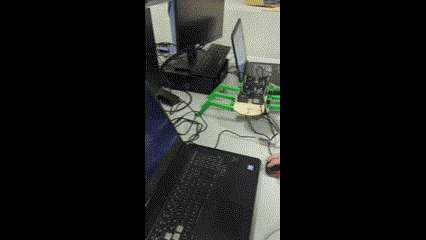

# **SpiderToKukaHand**  
*Engineering school project to design a Kuka Hand that can detach itself and act like a spider robot.*

---

## **Overview**  
The project combines robotics, mechanical design, and programming to enable a Kuka robotic hand to detach and function as a standalone spider-like robot. The system integrates control mechanisms for both the Kuka LBR7 robot and the spider robot using OpenRB boards and Dynamixel motors.

---

## **Kuka Control**  
To control the Kuka LBR7 robot, we utilized the **KST Kuka Sunrise Toolbox**:  
🔗 [KST Kuka Sunrise Toolbox on GitHub](https://github.com/Modi1987/KST-Kuka-Sunrise-Toolbox)  

The toolbox performed seamlessly for our control and communication needs.

---

## **Project Files**  
The project is organized into the following directories:  

- **`finalResult`**  
  Contains the final working code responsible for the result showcased in the video.  

- **`spiderRobot`**  
  Code controlling the spider robot using the **OPENRB board** and **Dynamixel motors**.

- **`kuka_joystick`**  
  Code to control the Kuka robot using an **Xbox gamepad** for real-time operation.  

- **`tests`**  
  Intermediate programs and prototypes developed to test specific functionalities during the project.

- **`3dFiles`**  
  3D printing files required to build the mechanical structure of the spider robot.

---

## **Demo**  
Watch the project in action:  
- 🎥 **Video Demo:** `demo_SpiderRobot.mp4`  
  

Making Of before the project is complete : 
  
---

## **Credits**  
**School:** Junia HEI Châteauroux  

### **Team Members**  
- **MATLAB Programmers:** Arnaud GODET, Mathias FOYER, Nicolas HERAULT  
- **Arduino Programmers:** Arnaud GODET, Nicolas HERAULT  
- **3D Mechanical Designer:** Angel BABOUHOT  
- **Report & Presentation:** Gabriel SANCHEZ DE LEON  